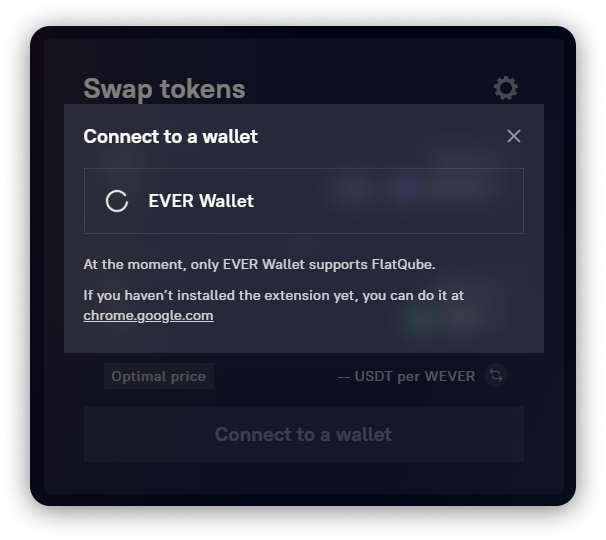
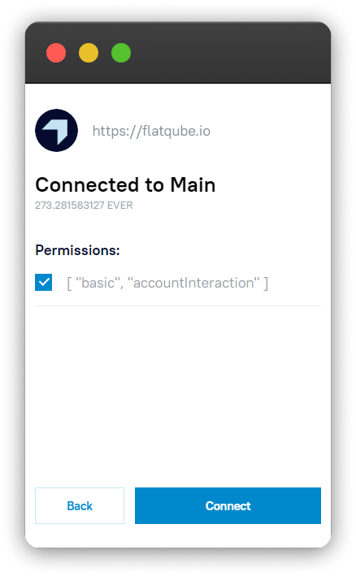

# ウォレットの接続方法

FlatQubeを使い始めるには、ウォレットを接続する必要があります。現時点で、接続可能なウォレットは[EVER Wallet](https://l1.broxus.com/everscale/wallet)のみです。

EVER Walletをまだお持ちでない方は、[インストール手順](https://broxus.gitbook.io/ever-wallet/getting-started-with-ton-crystal-wallet)へ進むか、直接[ダウンロードページ](https://l1.broxus.com/everscale/wallet)へ移動してください。

## パソコンでのウォレット接続手順

FlatQubeに入るとすぐに、\[**ウォレットを接続する**]ボタンが表示されます。

クリックすると、Ever Walletが接続されます。

![スワップページにある \[ウォレットに接続する\]ボタン](<../../.gitbook/assets/1 (2) (3).png>)

お使いのデバイスにEVER Walletがインストールされていない場合、ダウンロードリンク画面が表示されます：

EVER Walletがインストールされている場合、接続するアカウントを選択する画面が表示されます。


他のブラウザ拡張機能がEVER Walletのウィンドウをブロックしてしまうことがあります。そのような場合は、ツールバーのアイコンをクリックすると、保留中の認証が表示されます。


いずれかを選択し(FlatQubeは選択したアカウントのアドレス上でのみで機能します)、\[**次へ**]をクリックします。

.png>)

全ての**権限**を選択し、\[**接続**]をクリックします。

接続に成功した場合、右上にウォレットアドレスとEVERの数量が表示されます。\[ドア]アイコンをクリックすると、このウォレットとFlatQubeの接続を解除することができます。

## 携帯電話でのウォレット接続手順

携帯電話でEVER Walletを接続するには、EVER Walletアプリを開き、画面下部の<mark style="color:green;">**ブラウザ**</mark>をタップします。[FlatQube.io](https://flatqube.io/)に切り替わると、\[**ウォレットを接続する**]をクリックし、\[**許可**]をクリックしてこの操作を確定します。

.png>)

接続が完了しました！
