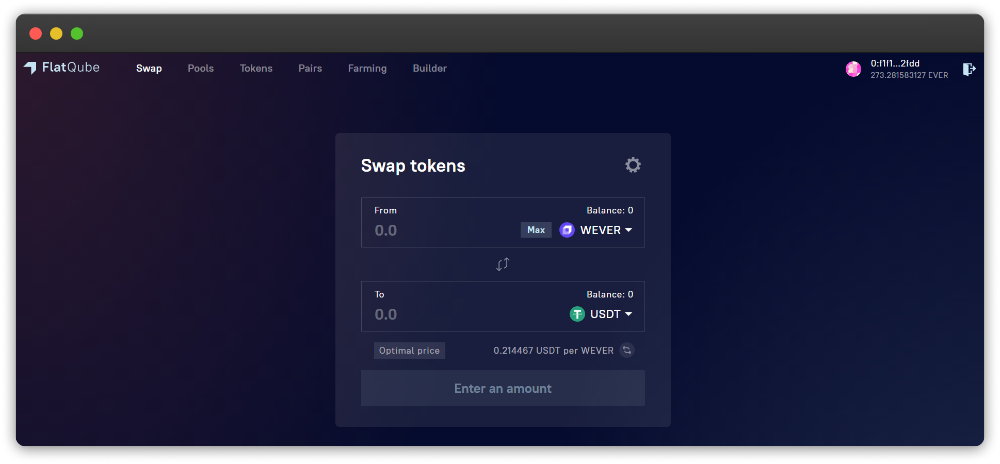

# インターフェース

さて、スワップセクションまで来ました。インターフェイスをもっと詳しく見ていきましょう。

スワップ画面の右上にある歯車⚙️\*\*\*は、**トランザクション設定**へのリンクです。\
\*\*\*\*ここで、[**許容スリッページ**](how-to/configure-slippage-tolerance.md)を設定できます。

.png>)

**上段に**交換するトークンの数量を入力し、**交換したい通貨量**(新規取得したい通貨量)を下段に入力します。\
\*\*\*\*\[**最大**]をクリックすると、交換可能なトークンが全て選択されます。

.png>)

**上段**と**下段**のトークン量が入力されると、さらにいくつかの情報が表示されます。

* \*\*\*\*[**許容スリッページ**](how-to/configure-slippage-tolerance.md) \*\*\*\* - トークンの予想価格とトランザクション時の価格差です。この限度幅を変更することで、トランザクションを行う際の最大スリッページ値を設定することができます。トランザクション完了時のトークン価格が指定した割合以上変動した場合、トランザクションは成立しません。
* **最低獲得量 -** 許容スリッページを考慮して最低限受け取れるトークンの量。
* **プライスインパクト** - このスワップによって生じる原資産の価格変動。
* **流動性プロバイダーの手数料** - 交換するペアのプールに流動性を提供した全てのユーザー(流動性プロバイダー)に手数料という形で分配されるトークンの量です。
* **最適価格**とは、交換しようとするトークンの価格比率です。\
  🔁をクリックすることで、トークン間の比率を選択できます。

.png>)
